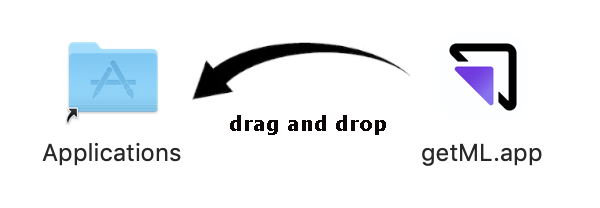

[](){#installation-macos}
# Install getML on macOS

This installation guide explains all necessary steps to install getML on macOS.
To download the getML suite, go to 

[https://www.getml.com/download](https://www.getml.com/download)

and click the download button. This will download a tarball containing everything you need to use getML: The [getML engine][engine], the [getML monitor][monitor], and the [Python API][python-api].

### System requirements

Your Mac should meet at least the following requirements to successfully install getML:

* macOS must be version 10.14 or newer. You can check your macOS version by running the following command in a terminal: `sw_vers`
* Python 3.7 or above must be installed on your machine. Furthermore, `numpy` and `pandas` are required dependencies for the getML Python API.

### Install and run the getML engine and monitor

The getML engine is the C++ backend of getML. It comes with a graphical user interface - the getML monitor - that runs in your browser. To install these components:

1. Double-click the `dmg`-file to open the installer, then drag the getML Icon into the Applications folder.
   

2. Double-click **getML.app** in the Applications folder to start getML. A security feature in macOS will ask you to confirm that you want to open getML when launching it for the first time. After confirmation, the getML icon in your status bar indicates that the getML engine is running.
   

3. Open a browser and visit [http://localhost:1709/](http://localhost:1709/) (if opening the getML.app did not point you there automatically). 

### Install the getML Python API

The Python API is a convenient way to interact with and to control the getML engine. There are two options to install the getML Python API:

#### From PyPI

In a terminal execute the following command to install the remote version from the Python Package Index:

```bash
pip install getml
```

To make sure that the Python API was installed properly, you can use

```bash
python -c 'import getml'
```

### Install the getML-CLI

getML comes with a [command-line interface][cli] (CLI) that lets you configure the most 
important parameters on startup. The CLI is a standalone Go-binary. The CLI is optional. If you are fine with launching getML from your Launchpad, you can stop reading.

Before you can use the CLI, you have to have launched getML from your Launchpad at least once. This is because when you launch getML for the first time, it creates a hidden folder in your home directory (called `.getML`) into which it copies the binaries and all necessary resources. Said hidden folder is then accessed by the CLI. 

After launching getML for the first time, you can find the CLI in `$HOME/.getML/getml-VERSION`.

```bash
./getml-cli
```

You can move `getml-cli` anywhere you want. We recommend moving the `getml-cli` to a location included in the `PATH` environment variable, such as `/usr/local/bin`. You can inspect the content of the aforementioned variable in a shell using:

```bash
echo $PATH
```

and check if it can be properly found by executing

```bash			
which getml-cli
```

If you see the location you moved the binary to as output, you are ready to go.

For further help on how to use the CLI, just use `getml-cli -h` or `getml-cli -help`.

### Uninstall getML

To uninstall getML from your Mac:

1. Drag `getml.app` from your applications folder into the trash.
2. Remove the folder `.getML` from your home directory. To do so, open your Finder and go to your home directory (`Cmd + Shift + H`). Hit `Cmd + Shift + .` to show the hidden files. Identify `.getML` and move it to the trash.
3. Delete `getml-cli` from wherever you have put it (if you have decided to install `getml-cli`).

### Where to go next

The [Getting started guide][getting-started] provides an overview of the functionality of getML and a basic example of how to use the Python API. In order to get help or provide feedback, please contact our [support][support].