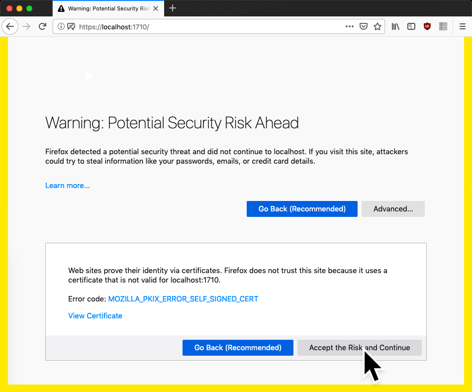
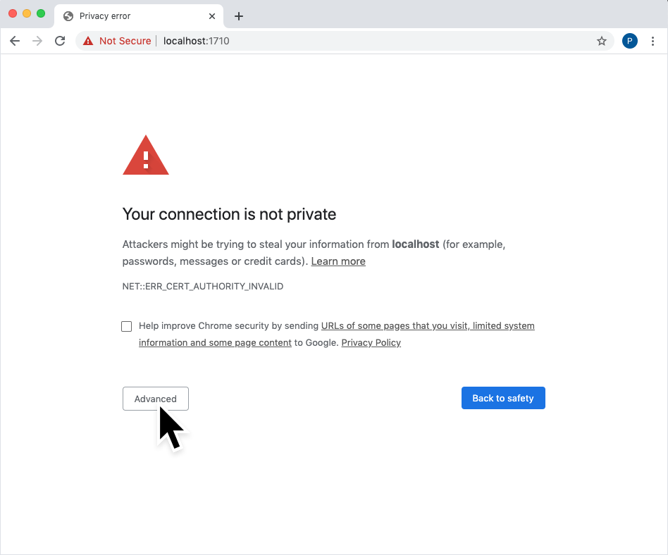

# Remote Access
[](){#remote-access-anchor}

This guide helps you set up getML on a remote server and access it from your local machine.

## Running the getML Suite Remotely

Note that this section is more of a how-to guide for SSH and bash than something that is specific to getML.

### Prerequisites

To run the getML software on a remote server, you should ensure the following:

1. You know the IP of the server and can log into it using a USER account and corresponding password.
2. Linux is running on the server.
3. The server has a working internet connection (required to authenticate your user account) and is accessible via SSH.

### Remote Installation

If all conditions are met, download the Linux version of the getML suite from [getml.com](https://www.getml.com/download) and copy it to the remote server.
```bash
scp getml-VERSION-linux.tar.gz USER@IP:
```
This will copy the entire bundle into the home folder of your USER on the remote host. Then you need to log onto the server.
```bash
ssh USER@IP
```
Follow the [installation instructions][installation-linux] to install getML on the remote host.

[](){#remote-access-start}
### Starting Engine and Monitor

Start getML using the command-line interface. It is a good idea to `disown` or `nohup` the process, so that it keeps running when you close the SSH terminal or if the connection breaks down temporarily.

```bash
./getML > run.log &
disown
```
or
```bash 
nohup ./getML &
```


Both methods will pipe the log of the engine into a file - either *run.log* or *nohup.out*.

### Login

Now the getML engine and monitor are running. To view the monitor, use port forwarding via SSH.
```bash
ssh -L 2222:localhost:1709 USER@IP
```
This collects all traffic on port 1709 of the remote host—the HTTP port of the getML monitor—and binds it to port 2222 of your local computer. By entering [localhost:2222](http://localhost:2222) into the navigation bar of your web browser, you can log into the remote instance. Note that this connection is only available as long as the SSH session started with the previous command is still active and running.

### Running Analyses Using the Python API

When you start a Python script, you should also `disown` or `nohup` it, as explained in the previous section.

If you want to know whether the Python process is still running, use `ps -aux`.
```bash
ps -aux | grep python
```
It lists all running processes and filters only those containing the letters 'python'. If your scripts appear in the listings, they are still running.

Running an interactive session using `IPython` is also possible but should not be done directly (since you will lose all progress the moment you get disconnected). Instead, we recommend using third-party helper programs, like [GNU screen](https://www.gnu.org/software/screen/) or [tmux](https://github.com/tmux/tmux/wiki).

!!! note 
    It is usually NOT a good idea to forward the port of the getML engine to your local computer and then run the Python API locally. If you decide to do so anyway, make sure to always use absolute paths for data loading.

### Retrieving Results

Once your analysis is done, all results are located in the corresponding project folder. You can access them directly on the server or copy them to your local machine.
```bash
scp USER@IP:~/.getML/getml-<version>/projects/* ~/.getML/getml-<version>/projects
```
### Stopping Engine and Monitor

If you want to shutdown getML, you can use the appropriate command.
```bash
./getML -stop
```

## Accessing the getML Monitor Via the Internet

Up to now you only have used the HTTP port of the monitor and required no
encryption. Isn't this insecure?

Not at all. The getML monitor is implemented in such a way the HTTP
port can only be accessed from a browser located at the same machine
the monitor is running on. No one else will have access to it. In the
scenario discussed in the [previous section][remote-access-start] all communication with the remote host had
been encrypted using the strong SSH protocol and all queries of the
getML suite to authenticate your login were encrypted too.

But allowing access to the monitor over the internet is not a bad idea 
in principle. It allows you to omit the port forwarding step
and grants other entities permission to view the results of your
analysis in e.g. your company's intranet. This is where the HTTPS port
opened by the monitor comes in.
### What is Accessible and What is Not?

Only the getML monitor is accessible via the HTTPS port. There is no way to connect to the getML engine via the internet (the engine will reject any command sent remotely).

After having started the engine and monitor on your server, connect to the latter by entering `https://host-ip:1710` into the navigation bar of your web browser. Every user still needs to log into the getML monitor using a valid getML account and needs to be whitelisted in order to have access to the monitor.

### Creating and Using TLS Certificates

The encryption via HTTPS requires a valid TLS certificate. The TLS certificate is created when you start getML for the first time. You can discard the current certificate and generate a new one in the configuration tab of the getML monitor. When doing so, you can choose whether the certificate should be self-signed or not. This is because HTTPS encryption is based on the so-called web of trust. Every certificate has to be checked and validated by a Certificate Authority (CA). If your browser knows and trusts the CA, it will display a closed lock in the left part of its navigation bar. If not, it will warn you and not establish the connection right away. But since a certificate must include the exact hostname including the subdomain it is used for, almost every certificate for every getML monitor will look different and they all have to be validated by a CA somehow. This is neither cheap nor feasible. That's why the monitor can act as a CA itself.

When accessing the getML monitor via HTTPS (even locally on [https://localhost:1710](https://localhost:1710)), your browser will be alarmed, refuse to access the page at first, and tell you it doesn't know the CA. You have to allow an exception manually. Since every monitor will be a different CA, there is no loss in security either.

### Adding an Exception in Browsers

In Firefox, you first have to click on 'Advanced',


followed by 'Accept the Risk and Continue'. 



In Chrome, you first have to click on 'Advanced',



followed by 'Proceed to localhost (unsafe)'.


### Opening the HTTPS Port

Telling the getML monitor to serve its web frontend via HTTPS on a specific port usually does not make it accessible from the outside yet. Your computer or the server does not allow arbitrary programs to open connections to the outside world. You need to add the corresponding port number to a whitelist in your system's configuration. Since there are far too many combinations of systems and applications used as firewalls, we won't cover them here. If you have questions or need help concerning this step, please feel free to [contact us][contact-page].

